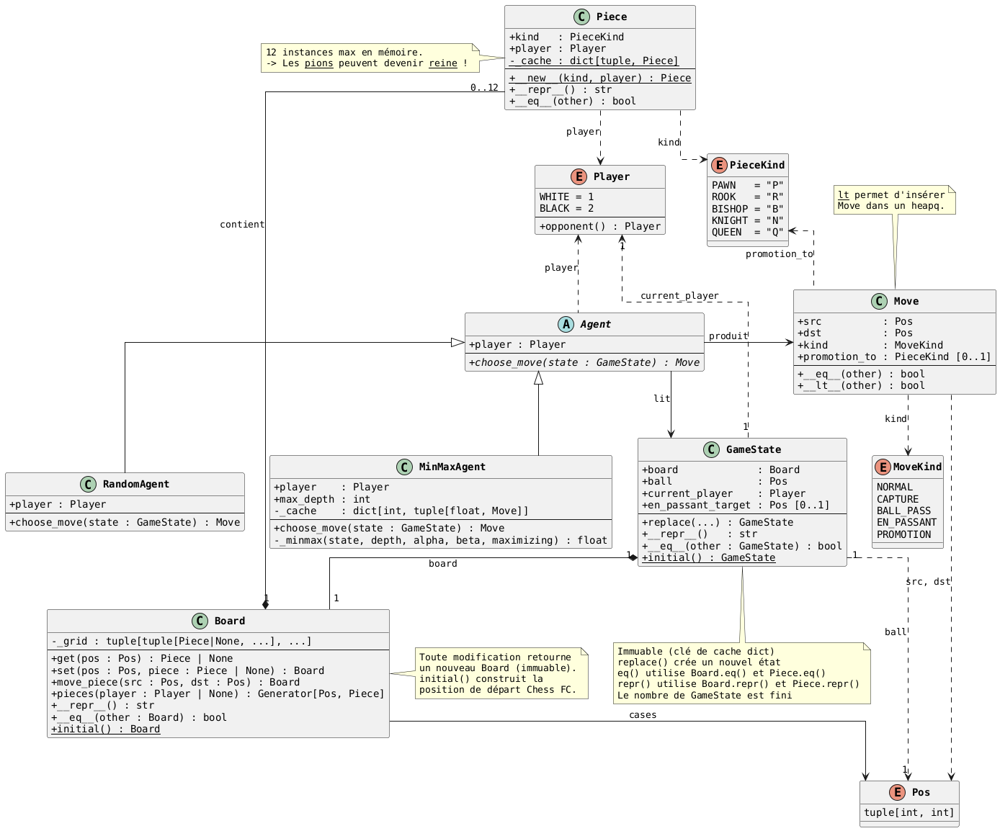

# IA02 — Chess-FC

*This repository was created as part of the **IA02 — Research Problem Solving & Logic Programming** project at UTC (Université de Technologie de Compiègne). Its goal is to design an artificial player capable of playing Chess FC, a hybrid game mixing chess and football, by applying the game‑tree search algorithms covered in the course*

---

## 🇫🇷 Présentation

Chess FC est un jeu de stratégie à deux joueurs combinant les règles des échecs et du football. Chaque équipe dispose de 6 pièces (3 pions, 1 tour, 1 fou, 1 cavalier) placées sur un terrain octogonal 9×7. Une balle est posée au centre : lorsqu'une pièce se trouve sur la case de la balle, elle ne se déplace pas, mais **tire la balle** vers les cases accessibles selon son type de mouvement. La première équipe à envoyer la balle dans le but adverse gagne.

Ce projet implémente en **Python** :
- La modélisation complète du jeu (plateau, pièces, coups légaux, états)
- Un joueur artificiel basé sur **Min-Max avec élagage α-β**
- La connexion au serveur de match fourni par les enseignants

---

## Structures de données

L'implémentation suit le style fonctionnel vu en cours (inspiré du tictactoe) : des **types immuables** et des **fonctions pures**, sans état mutable. Chaque structure est hashable et peut être utilisée directement comme clé de cache pour la mémoïsation.

### Types principaux

| Type | Définition | Rôle |
|---|---|---|
| `Pos` | `tuple[int, int]` | Position `(row, col)` sur le plateau |
| `Player` | `Enum` (WHITE, BLACK) | Identifiant du joueur |
| `PieceKind` | `Enum` (PAWN, ROOK, BISHOP, KNIGHT, QUEEN) | Type de pièce |
| `MoveKind` | `Enum` (NORMAL, CAPTURE, BALL_PASS, EN_PASSANT, PROMOTION) | Nature du coup |
| `Piece` | `NamedTuple(kind, player)` | Une pièce sans position (la position vit dans la grille) |
| `Move` | `NamedTuple(src, dst, kind, promotion_to)` | Un coup joué |
| `Grid` | `tuple[tuple[Piece \| None, ...], ...]` | Grille immuable 7×9 |
| `GameState` | `NamedTuple(grid, ball, current_player, en_passant_target)` | État complet du jeu |

### Le plateau

Le terrain est un rectangle 9 colonnes × 7 lignes (A→I, 1→7) dont les quatre coins sont coupés, formant un octogone. Les cases invalides sont stockées dans un `frozenset` constant `INVALID_POSITIONS`, ce qui permet un test `O(1)` via `is_valid_pos()`.

```
   A  B  C  D  E  F  G  H  I
1        .  .  .  .  .
2        .  .  .  .  .  
3  .  .  .  .  .  .  .  .  .
4  .  .  .  . [.] .  .  .  .   ← balle en E4
5  .  .  .  .  .  .  .  .  .
6        .  .  .  .  .  
7        .  .  .  .  .
```

**Buts :** WHITE marque en colonnes H ou I — BLACK marque en colonnes A ou B.


## Algorithme

Le joueur artificiel utilise **Min-Max avec élagage α-β**, fidèle au pseudo-code du cours :

- WHITE maximise, BLACK minimise
- La profondeur est limitée (`max_depth`) avec une **fonction d'évaluation heuristique** pour les états non terminaux
- La mémoïsation est assurée par un cache `dict[GameState, float]` — possible car `GameState` est entièrement immuable et hashable

### Diagramme UML (conception initiale)

> Le diagramme ci-dessous représente la conception initiale du projet. L'implémentation finale s'en écarte volontairement : les classes ont été remplacées par des `NamedTuple` et des fonctions libres, dans le style fonctionnel du cours.




---

## Collaborateurs

*Projet réalisé par Clothilde MARKO--LAFON et Thomas ALBA.*